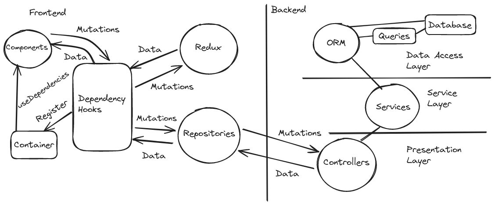

# Posterr (David)

Make sure you have a nice markup visualization tool for following this readme.

The platform was written with Rails in the backend (api-only), PostgreSQL as the database, and React + Tailwindcss in the frontend. React Query has been used for the api communication, and Redux for frontend-only state.

## Installation

You need to have docker composer installed in your system. Then, you can run the app by simply doing

```
    cp .env_example .env
    docker compose run rake db:create
    docker compose run rake db:migrate
    docker compose run rake db:seed
    docker compose up
```

You have to use "docker-compose" instead depending on your environment.

After the build, you should be able to access the app via http://localhost:3000.

The backend api will be accessible through http://localhost:5000.

To run the end to end tests, make sure you have Cypress installed in your system ([Cypress installation guide](https://docs.cypress.io/guides/getting-started/installing-cypress)).

Usually $ npm install cypress $ should be enough.

## Creating posts

The database doesn't have any seed posts. One can directly create them using the UI.

The assessment document asked not to implement authentication logic, so I have hardcoded users both on the backend and frotnend. The current user can be chosen through the sidebar to make things easier. This is important while testing repost logic, so that you can create posts on behalf of other users.

## Running the test suites

You can run the backend tests by doing

```
    docker compose run rake
```

and the frontend tests by doing

```
    docker compose run npm test
```

In order to run the end to end tests, stop the current application through running $ docker compose down $, make sure nothing is listening on port 5000, then make the test environment available through

```
    docker compose -f cypress.yml up
```

Now you can go to the frontend folder and run npx cypress open.

####Note:

I'd like to setup Cypress so that it runs entirely in a docker container like everything else, but the Cypress GUI integrates with the system is such a way that I couldn't find a reliable way to do that given the time constraints. It seems that the solution is also dependent on the developer host, so that would maybe not be advisable for me to do here, and I think that whoever will be reviewing this project will find it neat to watch the tests running through the browser GUI.

If you run into problems with Cypress, try doing sudo chmod +777 -R on the node_modules folder and running npm install locally before running Cypress.

## Utility commands

You can run rake commands like this:

```
    docker compose run rake
```

The command above will run the backend tests. If, as a developer, you want to run database migrations, you can do:

```
    docker compose run rake db:migrate
```

Every rake command can be run in an analogous fashion.

Similarly, you can access the development console like this:

```
    docker compose run rails console
```

and run other rails commands against the development environment.

You can also run npm commands like this:

```
    docker compose run npm test
```

## Architecture

The diagram bellow gives an overview of the platform architecture.



### Disclaimer

For such a simple platform, this code is, absolutely, overengineered. The goal here is to showcase approaches to tackling more complex platforms and challenges, and to address every single point listed in the Strider Technical Assessment Briefing.

That being said, the code is concise and semantic, and some ideas result in pretty neat code design and testability.

### The 80/20 rule

To address some of the points mentioned in the Briefing and to enhance testability, many software engineering ideas have been used, such as the idea of separation of concerns.

Such ideas can be very helpful when developers are mindful of them, but they might lead to boilerplate and overbloated code if they are taken to the extreme.

To give one example, I have taken some care to decouple the ORM implementation (ActiveRecord) from the interface between the Data Access Layer and the Services Layer. To accomplish that, I have defined a bunch of semantic methods on the Post model and the PostFeed query, to be accessed by the PostService (more on that later).

Such decoupling allows the business rules to be defined inside of the PostService without using the ActiveRecord interface. The Data Acess Layer wraps ActiveRecord in a simpler, more semantic and domain-specific interface that the Service Layer can access.

While the idea is neat, if I were to take that to the extreme, I would envelop some of the ORM methods, such as "post.save!", in a new method, that would have to be called something like "post.persist" or something equivalent. Or, worse, I could have decided that such potential namespace clashes are a code smell, and wrap Post in a new class entirely. All of this would be useless, trivial boilerplate code.

The developer, using of good judgement, can simply *imagine* that such trivial wrappers are there. Being mindful of this, they can make decisions about when it is worth it to actually write down the wrappers.

I call this the 80/20 rule: we can get most of the benefits of the architectural ideas while still being pragmatic. I'll refer to the 80/20 rule multiple times later on.

### The Service Layer

The Service Layer implements *all* the business rules, except the data validations. This is a classic example of the 80/20 rule: if we were to take things to the extreme and try to address every business rule at the Service Layer, we would either get performance issues and race conditions, or duplicate logic.

That's easy to see with an example: users should have a unique username. However, the Service Layer runs at the servers, not the database. If the servers are scaled horizontally, or even if as much as multiple requests are handled concurrently, then there is the possibility that enforcing that rule at the Service Layer level will lead to two users being saved with the same username.

Every other business rule is implemented at the Service Layer.

We have a PostService that can be instantiated with a user, like this:

```
    post_service = PostService.new(@user)
```

Then, it exposes four methods:

```
    post_service.create_post(content)
    post_service.get_posts(page, search_term, sorting)
    post_service.n_posts(search_term, sorting)
    post_service.repost(post)
```

Both create_post and repost will do those actions on behalf of the user that was used before to instantiate the post services. Right now, get_posts doesn't change based on the user, but the service has been designed this way to anticipate the fact that, in the hypothetical future development of the platform, different users would probably see different feeds, so that all three methods are subject to the same "Point of View" context: the user.

The interesting thing here is that post and user are only required to implement very minimal interfaces. Those interfaces, together, represent the interface between the Service Layer and the Data Access Layer. Like it was mentioned before, they are not ActiveRecord interfaces, but rather I made sure they represent something that makes sense for the business domain.

This is what "Post" should implement:

```
    def self.new(content, user); end; => post
    def self.new_repost(post, user); end; => post
    def self.feed; end; => feed
    def save!; end;
    def user; end; => user
    def is_repost; end; => bool
```

And what "User" should implement:

```
    def posts_today; end; => post[]
```

where I'm using a pseudo typing language where => indicates the return type and eg. post[] is a *query* of posts (not an array!). Capitalized (eg Post) means the class and lowercase (eg post) means an instance.

Except for new and save! (refer to the 80/20 rule), none of this is specific to ActiveRecord, and rather describes the relationships between types in our business domain.

Notice that the Service Layer, as noted above, doesn't distinguish between posts and reposts in terms of implementation. They only expect them to be distinguished by a boolean is_repost flag.

As we'll see, the reposts are implemented via a different class, Repost, in the Data Access layer. That's necessary because, as we'll see, reposts are actually a many-to-many relation, so they need a separate table in the database. The Service Layer doesn't need to know about such implementation details. This leads to further healthy decoupling between the layers.

The "feed" type is a new thing. As far as the Service Layer is concerned, it doesn't need to be different from posts[] at all. What matters is that it implements a Query Interface. Let's talk about that.

#### The Query Interface and the PostFeed

Many ORMs implement a query interface. ActiveRecord is no exception.

ActiveRecord Queries are a useful way to provide separation of concerns without sacrificing performance. They are used to build a database query, step by step, in higher layers, and only perform the actual database query in the end.

What is important is that, if it wasn't for the query interface, *all the business rules related to a query would have to be moved to the Data Access Layer*, since the query would have to be defined as a query string to be executed against the database, and that can only be done at the Data Access Layer.

The query interface allows us to define certain operations at the lower Data Access Layer levels, and make those semantic operations available to higher layers, where they can be organized according to business rules.

The essential aspect of the implementation of the query interface is the commutative composability of the operations, which is achieved by the query having methods that return another query with the exact same interface.

PostFeed is a query that represents the posts feed. This is the interface:

```
    def original; end; => feed
    def latest; end; => feed
    def trending; end; => feed
    def search(search_term); end; => feed
    def page(page); end; => feed
```

As you can see, all the methods defined on feed return a feed, so that all operations are composable and commutative.

On top of that interface expected by the Service Layer, all of the ActiveRecord query methods are also available on feed instances. The only time that this is used, though, is on the Presentation Layer, with the length and the to_a method.

The post[] also, in practice, implements all of the ActiveRecord query methods, but the Service Layer only uses posts.length.

Again, we don't need to go crazy about defining these interfaces in extreme detail or making sure that they are strictly enforced by raising exceptions if something unexpected is called or something like that. Essentially, we are in Ruby land, so let's embrace a little bit of the prevalent methodology, often refered to as *duck typing*. The important portions of the interface are listed above. Refer to the 80/20 rule.

### The Data Access Layer

The Data Access Layer is comprised of the database, the ActiveRecord models and the Queries.

As mentioned before, validations must be implemented at the database level. I have used PostgreSql constraints to accomplish that. The constraints are created using ActiveRecord migrations, and I make sure they have a corresponding downgrading mechanism.

Other than that, every single line of code in the ORM aims at exposing methods that the Service Layer will use to implement the remaining business rules. Those methods have been listed above.

#### Reposts

Each user might have done multiple reposts, and each post might have been reposted by multiple users. As such, we have a many-to-many relation, and I call the join table the "reposts" instead of something like "user_post", as the former is much more semanting to what the table represents and the later would be mistaken for the regular relationship between users and posts, which is one-to-many.

The repost.save method is modified so that it increases the reposts count of the corresponding post. This aggregator is essential for optimizing the trending sorting query. Again, this is not a business rule, but rather an optimization detail.

As mentioned before, Repost is made to reasonably implement the "post" interface at the Service Layer level. This is *not* taken to the extreme, though. For example, we could add a "self.new_repost" method to Repost, returning Repost.new. That method would never be actually called in the Service Layer though, so we avoid boilerplate. Again, refer to the 80/20 rule.

#### The PostFeed Query object

The star of the Data Access layer, however, is the PostFeed. It is not an ActiveRecord model, but a query wrapper that implements all of the ActiveRecord query methods (through delegation), plus the interface listed above. When any ActiveRecord query method is called on the PostFeed, it returns another PostFeed if that method returns another ActiveRecord query, and returns the result otherwise. This way, methods like where, to_a and length work automatically on the PostFeed instances, and they behave like you would expect.

In terms of the interface, and as far as the Service Layer is concerned, the PostFeed is *exactly* the same as a Post query with some scopes ("original", "search", "latest", etc). So you might ask, why didn't I just implement those methods with scopes, instead of creating a new Query class?

Initially, I did. However, if ".feed" was a Post scope, it would not be commutative with other scopes. That's because the result of "Post.feed" is a union with the Repost table. Some of the scopes, such as "original", would *break* if they were applied before "feed". So "Post.feed.original" would work, but "Post.original.feed" would break.

I felt like this was betraying the expectations that Rails developers have on how scopes work (they usually commute), so it is better to *explicitly* tell the reader that the return of "Post.feed" is a different type from, say, "Post.all", and the way of doing this is declaring that type as a new class.

Again, "PostFeed" is an implementation detail at the Data Access layer and, as far as higher layers are concerned, the "feed" type is just a regular post query, with some added fields such as "is_repost" and "reposter_id".

The Post.feed method has the actual query used to generate this PostFeed. It uses the active_record_extended gem to be able to actually create a union query.

Indices have been added to the database so that this query is performant for any combination of sorts and filters.

### The Backend Presentation Layer

The Presentation Layer is pretty simple, it exposes the services and handles request arguments and returns. This is the entire api:

```
    POST post/create_post : (user_id, content)

    GET post/get_posts : (user_id, page, search_term, sorting)
        => feed

    POST post/repost : (user_id, post_id)
```

I took the care to make sure the controllers handle exceptions and return a response with the properly crafted http status error.

### The Frontend Repositories

The postRepository abstracts away the interface to the backend from the rest of the React application. It provides a group of hooks that can be used by React components. These hooks provide backend data and mutation methods to the components.

The core idea behind the implementation is to handle backend data as state. If we look at the useState hook, for example, $ [counter, setCounter] = useState(1) $, then counter represents the state and setCounter is a mutation of that same state. The repositories are implemented in a similar fashion.

But we're not talking about a syntactical similarity. The postRepository hooks make use of the React Query library, which handles all the implementation details of wrapping async routines into a state/mutation paradigm. The backend holds the state, and the repositories read that state and mutate it. On a successful mutation, the queries are explicitly invalidated and the data is refetched.

I won't delve too much into React Query here, otherwise it would feel like I'm documenting their library usage, but, it suffices to say, I'm wrapping the fetch calls to the api in a query or mutation (depending on the direction of data flow), and making the query/mutation available to components via a hook.

For getting paginated data, I'm using the useInfiniteQuery hook.

### Redux

Is there a need of Redux for this project? Absolutely not. Again, I'm treating this as if it is a larger project. In visual terms, the search is as far away from the posts as you can get in a single page: each is in a different top-level element (feed vs widgets menu), but in actuality they are only at only one or two node distance in the component tree. Prop drilling would suffice.

That being said, it is cool to use Redux and handle it in the same way as we're handling the repositories. As I described before, the repositories provide components with data and mutation methods through hooks. That's exactly what Redux does, too.

So, we have a symmetry, and we can treat all app data in the same way, regardless of whether it comes from the backend or the Redux store!

This will be accomplished with Dependency Hooks.

### Dependency Hooks

This is a original idea that I had while developing this project. It combines an IoC (Inversion of Control) Container with React hooks.

In the section on testing, I'll talk more about how dependency injection has been used both in the backend and the frontend to enhance testability.

Dependencies are couplings between different units of the code. Often, these couplings involve modifications to global state, modifications to a database, disk access and network requests.

When unit testing, we want to isolate the units from i/o operations, so that tests are all done in memory and performant. We also want to isolate them from global state, otherwise we are not testing a unit, but, in part, the entire application.

So a common pattern for unit testing is extracting dependencies from the units and somehow injecting them, both at runtime and while testing. The test will inject premade dependencies, used to probe the unit in isolation, as a single cog in a machine.

Like I described before, the components get all the dependencies from either Redux hooks, or the Repository hooks, which in turn are wrapping React Query hooks. So all the dependencies are hooks. Why not, then, extract all the dependencies of a component into a single hook?

That is part of the idea behind the useDependencies. Another way to understand this is as a component wrapper. For example, imagine that I have this:

```
    const SomeComponent = () => {
        const user = useSelector((state) => state.currentUser);
        return <div>user.name</div>
    }

    export default SomeComponent;
```

This component is using a useSelector to get the currentUser from the Redux store.

How would one go about testing this? One might want to stub or mock the useSelector call. Mocking library objects like that is usually frowned upon and it makes tests often spend way too much time hacking libraries and objects in order to properly mock them instead of actually testing anything.

Ideally, anything that you want to mock or stub should instead be passed as part of an interface. In order to do that, you have to extract dependencies.

So you could build a wrapper:

```
    const SomeComponentWrapper = () => {
        const user = useSelector((state) => state.currentUser);
        return <SomeComponent user={user} />
    }

    const SomeComponent = ({user}) => {
        return <div>user.name</div>
    }

    export default SomeComponentWrapper;
    export { SomeComponent };
```

Now other components will import the wrapper component without any change to their file, and you can import the isolated component into your tests and pass the user object as a prop. No need to mock, just create some data with the proper interface.

This seems to work well until you try to test some other component that is using SomeComponent:

```
    import SomeComponent from "./SomeComponent"

    const SomeOtherComponent = () => {
        return <SomeComponent />
    }

```

Here, "SomeComponent" is the wrapped component, so, even if you extract all the dependencies from SomeOtherComponent, SomeComponent will still be calling it's actuall dependencies (Redux hooks, backend requests, etc).

Before telling the solution to that, let be just say that this:

```
    const useWrapper = () => {
        const user = useSelector((state) => state.currentUser);
        return { user }
    }

    const SomeComponent = () => {
        const {user} = useWrapper();
        return <div>user.name</div>
    }

    export default SomeComponent;
```

is 100% equivalent to the code before. So the hook works essentially as a wrapper component.

Now we need a way to make the "useWrapper" swappable somehow. You might think we could just pass it as a prop, but that would make us have to modify SomeOtherComponent to pass the wrapper as a prop, and, when testing SomeOtherComponent, there would be no simple way of swapping dependencies. The typical solution to that kind of problem is to use a IoC container.

I won't delve into the implementation of the dependencyContainer that I did, I think it is more important to just tell how to use it. So instead of the code above, we do:

```
    dependencyContainer.register('SomeComponent', () => {
        const user = useSelector((state) => state.currentUser);
        return { user }
    })

    const SomeComponent = () => {
        const {user} = useDependencies('SomeComponent');
        return <div>user.name</div>
    }

    export default SomeComponent;
```

as you can see, very little code has changed. But, now, we can entirely swap the dependencyContainer while doing tests.

The dependencyContainer is being provided at the App.tsx level (with a hook based on the useContext hook). During tests, we just need to render the component with a different container, like this:

```
    <ContainerProvider container={dependencyContainer}>
        <SomeOtherComponent />
    </ContainerProvider>
```

The thing is that the dependencyContainer can be used to provide custom dependencies to *every* component in the component tree under SomeOtherComponent. This way, it can be tested in isolation from anything other than it's children. The children are isolated from any external dependencies other than the props passed by their parent.

The dependencyContainer can be thought of as an external library. All that a developer working on this project typically will need to worry about is creating a hook with the dependencies of a component, registering it to the container, and then use the useDependencies hook.

This way, we have a very clean interface separating both Redux and the Repositories from the unit testable components.

## Tests

### Overview

We have unit and integration, both on the frontend and backend, and end-to-end tests

The frontend tests rely heavily on the dependency injection discussed previously. For the backend, a combination of dependency injection and mocking was used. ActiveRecord is not mocked: the only thing mocked are special private methods in the PostService that were designed specifically to be mocked: they were designed specifically to isolate the side effects. So, instead of mocking post.save!, we mock post_service.save_post. I feel like this is a good practice as it makes mocking trivial: everything that needs to be mocked are methods defined on the actual unit that is being tested. These methods isolate the side effects, so that, when mocked, the service can be tested as a unit, and we are properly testing the business logic instead of hacking implementations.

At least one test has been written for every single one of the business rules on the assessment document. Each of the backend layers has been tested.

### Data Access Layer

The Data Access layer is tested as a whole: we are not testing ActiveRecord models as a unit, but rather testing the actual working of that layer, otherwise we would be mostly testing ActiveRecord itself. We are testing the business logic on that layer, including model-level validation, database constraints, etc.

The PostFeed is not tested separately from the Post. Again, PostFeed is more of an implementation detail of the Post than a unit of it's own.

Whether these Data Access Layer tests are unit tests or integration tests, I leave for you to decide. It is kind of a subjective topic, as a "unit" can be thought of as a class, but it can also be thought of as a unit of functionality. Here, we have two data access models, Post and User, and I regard the database as their implementation detail. I don't want to test PostgreSQL in isolation from ActiveRecord. On this level, it makes sense for me to test both as a single unit.

### Service Layer

The separation of layers is where we need the isolation. So the Service Layer is subject to a very classic modality unit testing: the interfaces are well defined like we detailed before. Here, I could create stub objects to be passed to the PostService while testing, but the 80/20 rule tells me I have a very simple way of creating objects that implement the necessary interfaces: just creating post and user instances. Since no side effects happen (nothing changes on those records) because the side effect methods have been isolated and mocked, then this is equivalent to passing a stub with the test data.

Where we need to actually construct an object is to stub the PostFeed. The real PostFeed builds a query, which gets executed against the database. We don't want that, and we want to test whether the correct query is built, at the semantic level (not the sql level), through the semantic interface we defined to implement the business rules. Again, the interface for the query is well defined and documented above. In the tests, we create a simple array object mocking the "scopes" and implementing pagination via Kaminari.paginate_array. With this, we can test all the business rules.

### Presentation Layer

All the business logic has been tested above in minimal detail. So the controller tests have a simple goal: check if all the pieces work together. There are simple tests with the goal of checking if every piece is connected properly and if nothing major is broken.

### React Query and Redux?

For this project, I'm not unit testing the stores or repositories. I feel like the end to end tests are a more interesting way to make sure things are working together in the frontend.

### Dependency Hooks?

The dependency hooks exist for separating the coupling between the components and the redux store or the repositories. So it doesn't make sense to "unit test" them. There could be integration tests, but, again, for this project I'm relying more on end to end tests for the frontend.

### Components

For testing the components, we create a dependency container with all the data that the components will get through the useDependency hook. This dependency container will also contain mocked methods for each mutation. This way, we test the component in isolation with sample dat, and guarantee that the proper mutations are being called when they should.

The only thing that is actually mocked is the IntersectionObserver library, which is used for the infinite query to work as a timeline. This is unfortunate and the only reason I'm doing this is because there is some bug when the IntersectionObserver is used together with react testing library. I didn't want to spend too much time on modifying the library or looking for an alternative. The test doesn't need it, so merely mocking it does the trick for now.

### End to end

The end to end tests don't test every single business rule, but they do a significant job of detecting any issue with any piece of the platform. They test most of the macro requirements and, of course, every piece needs to work together in order for them to pass.

An issue with cypress scrollTo prevented me from implementing a test for the infinite scrolling. I don't want to spend too much time on debugging this because this is a test project, but I would focus one hour on that if this was a real project. After running all the cypress tests, you can access the frontend at localhost:3000 and see a state of the platform with 20 posts (the most you can do with 4 users in one day) and test it manually.

## Critique

- This is a big one: I didn't have the time to write comments. I'm so sorry. I worked more heavily on the README and thought I would have spare time to add comments after all, but I didn't. I should have written comments while I was developing.

- I didn't make a responsive layout. That would be the first thing I would tackle if I had more time.

- The frontend tests are not as comprehensive as the backend and end to end tests. A lot was done to allow tests to be developed with good practices, but that could be used more.

- The UI can improve.

- Think about localization issues. The "5 posts in one day" rule, together with time constraints, made me think it is better for the frontnend to share the backend post date, as to be transparent to the user. That, of course, is not acceptable in production, and a discussion should be had regarding requirements. Maybe "5 posts in one day" should be "5 posts in every 24 hours", for example.

- In my experience during this project, Redux has some downsides. For example, the Redux dispatch method doesn't accept a callback (unless extensions are installed), and I had to listen in the Feed component for changes on the search and sorting parameters through my custom useOnChange hook in order to invalidate the query cache. This doesn't feel good: global state should be handled globally. In hindisght, I realize that, since useQuery works with any async method (and a sync method can be made async), it would be cool to experiment with the idea of React Query handling all state, taking advantage of the symmetry mentioned earlier and removing Redux.


### On scaling:

I cannot say which parts would fail first, as that is highly dependent on deployment. If eg. the Rails server would be deployed in a very capable server, and the database in a very poor server, the later could fail first, etc.

Now, in terms of services/routes, the heavier service is obviously the getPosts one. Not only does it exchange more data, and queries the database more intensively, but it is also called more often than the ones to create posts or reposts in a typical user experience.

Now, in the particular way this platform works, it begs for the implementation of a cache for post feeds as one of the first measures towards performance optimization. Since, in the current format, every user sees the exact same feed, then requests that happen for the post feed at around the same time could be hitting a cache and not the actual database. This pertains especially to the first page load, and also before the user scrolls down too much or a search has to hit too deep into the database.

I won't delve too deep into caching strategies, but let's say we could have a number of redis nodes that are periodically updated with the latest posts, including on mutations. That takes a lot of load off the main database, as thousands of simultaneous users are reading the post feed from all these redis nodes instead of hitting the main database. On mutations (post creation, reposts), the writes can be done both to the database and to these multiple instances through a pub-sub architecture, which can be implemented using a messaging broker such as Kafka, RabbitMQ or cloud-specific solutions.

Both the latest and trending feeds can be cached.

If even then the database server is under heavy load, because there are too much searches being done for keywords that have not been cached, or if users are requesting too much old posts and the redis caches don't have enough memory to hold them, etc, then we can enhance the database with read replicas.

See, the writes are much lower load and happen less often than the reads. Now, with read replicas, we can "scale the database horizontally" from the point of view of making the post feed available to more users.

To scale the server for all the concurrent requests, the first thing we need to do is scale horizontally, which can happen elastically on demand. We can handle both the server scaling and the redis caches with a tool like Kubernetes for container orchestration.

In order to direct the requests, of course, and also for aditional caching, we should use a Load Balancer. Of course, other standard caching systems would be in place, such as CDNs for the assets.

Other more advanced scalability strategies might be needed at some point, such as database sharding, microservices, etc, but here I'm addressing the most likely scenario together with the first strategies that could be tried.